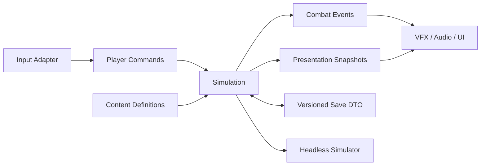

# Ashvault ARPG Kernel Specification

| | |
| --- | --- |
| **Status** | Accepted for M0 implementation |
| **Version** | 0.1 |
| **Runtime** | Godot 4.7.2 |
| **Targets** | Windows and macOS |

## 1. Purpose

This document defines the production boundary for Ashvault's first vertical
slice. The existing `project-ashvault/prototype/` scene remains a numerical
experiment and is not a production API.

The kernel must support long-lived ARPG content without duplicating rules in
skills, items, enemies, UI, saves, or scenes. Simulation is deterministic for a
fixed version, seed set, initial state, and command stream.

## 2. Architectural boundary



- `Simulation` owns authoritative gameplay state.
- `Presentation` may interpolate and decorate state but cannot mutate it.
- Godot scenes compose lifecycle and visuals; they do not define combat rules.
- Godot Resources are immutable authored definitions.
- Runtime instances are plain simulation objects identified by stable IDs.
- Save DTOs contain data, not Nodes, Resources, callables, or scene paths.

## 3. Identity, tags, and versions

Stable content IDs use lowercase dotted names, for example
`ability.stormweaver.arc_bolt`. IDs are never derived from localized names or
filesystem locations.

An ID contains at least two dot-separated segments. Each segment starts with a
lowercase ASCII letter and may then contain lowercase ASCII letters, digits, or
underscores. Leading/trailing dots, empty segments, hyphens, whitespace, and
uppercase characters are invalid; values are rejected rather than normalized.

Tags use a validated registry and lowercase dotted names, such as
`damage.lightning`, `delivery.projectile`, and `event.kill`. Unknown IDs or tags
fail content validation before a run starts.

Tag registration is atomic for a batch: any invalid or duplicate tag rejects
the entire batch. The registry is frozen before a validated catalog is
published, and later registration attempts fail rather than mutate live rules.

The following versions are independent:

- `content_version`: authored definition compatibility.
- `simulation_version`: deterministic rules and replay compatibility.
- `save_schema_version`: serialized DTO layout and migration compatibility.

External research IDs never become canonical content IDs.

## 4. Commands and simulation clock

Simulation advances on a fixed tick. Presentation frame rate does not determine
combat results. Input adapters emit commands containing:

```text
tick
actor_id
command_type
aim_vector
ability_slot
client_sequence
```

The slice supports movement, aim, cast start, cast release, and cancel. Unknown,
late, impossible, or duplicate commands are rejected with a diagnostic result;
they do not partially mutate state.

The `client_sequence` field is reserved for future authority validation. It does
not imply networking in the slice.

## 5. Deterministic RNG

Every run owns named RNG streams:

- `combat`: crits, proc rolls, and combat variance.
- `loot`: rarity, affix, and roll generation.
- `dungeon`: room graph and encounter selection.

Each stream exposes seed and serializable state. Adding a loot roll must not
change dungeon generation. Gameplay code may not use global random functions.

Determinism is guaranteed only within the same `simulation_version` and
`content_version`.

## 6. Stats and modifiers

A modifier contains:

```text
stat_id
operation
value
source_id
condition_id?
priority
```

Supported operations resolve in this order:

1. `BASE`
2. `FLAT`
3. `INCREASED`
4. `MORE`
5. `CONVERSION`
6. `OVERRIDE`
7. `CAP`

`INCREASED` values add within one bucket. `MORE` values multiply. Conversion is
normalized so a source type cannot convert more than 100%; over-allocation uses
stable priority then source ID ordering. Caps apply after overrides.

Stat aggregation produces an immutable snapshot for one simulation tick.
Definitions contribute modifiers but never write final values directly.

## 7. Damage pipeline

All attacks create a `DamageContext`; only the pipeline creates a
`DamageResult`.

```text
source_entity
target_entity
ability_id
origin_event_id
tags
base_components[]
modifiers[]
```

Resolution order is:

```text
base + flat
-> increased
-> more
-> conversion
-> critical
-> defense
-> resistance and penetration
-> conditional modifiers
-> final clamps and rounding
```

Damage is stored as floating point during resolution and rounded once when
committed to health. Negative final damage is forbidden; healing is a distinct
effect type. A result records component breakdown, mitigated amount, critical
state, and contributing source IDs for debugging and simulation reports.

Skills, items, status effects, enemies, and UI cannot implement alternative
damage math.

## 8. Combat events and proc safety

Events are queued rather than recursively executed. Every event contains:

```text
event_id
chain_id
depth
event_type
source_entity
target_entity?
source_definition
tags
payload
```

The default maximum proc depth is 8. A trigger cannot react to another event
created by the same trigger in the same chain unless its definition explicitly
sets `allow_self_reentry`. The queue has a per-tick budget; budget exhaustion
fails the simulation test and emits a diagnostic in development builds.

Core event types include cast, hit, critical, damage, status applied, death,
kill, block, dodge, item dropped, and item picked up.

## 9. Abilities and effects

An `AbilityDefinition` declares tags, cost, cooldown, cast timing, targeting,
delivery, and an ordered effect list. Effects may deal damage, apply a status,
move an entity, spawn a projectile or persistent entity, or emit an event.

Ability ranks select data values or milestone behaviors. They do not branch on
item names. Items and passives modify abilities through tags, modifiers, or
validated effect transforms.

The Stormweaver slice binds:

| Input | Ability | Required kernel coverage |
| --- | --- | --- |
| LMB | Arc Bolt | Aimed projectile and critical hit |
| RMB | Chain Lightning | Target chain and shock |
| Q | Thunder Nova | Player-centered area |
| E | Static Ward | Timed defensive status |
| R | Storm Totem | Persistent casting entity |
| Space | Tempest Dash | Movement, invulnerability window, cancel rules |

## 10. Items and rarity semantics

`ItemDefinition` is immutable authored content. `ItemInstance` contains:

```text
uid
definition_id
item_level
rarity
affixes[]
rolls[]
sockets[]
quality
metadata
```

UID creation belongs to the simulation boundary. Copies retain definition IDs
but never reuse UIDs.

The slice uses these generation rules:

| Rarity | Role |
| --- | --- |
| White | Base, quality, sockets, runeword eligibility, crafting potential |
| Blue | At most two affixes, higher individual tier ceiling, cheapest targeted reroll |
| Gold | At most four affixes and broad emergent combinations |
| Green | Target-farmable fixed implicit plus two or three random affixes |
| Purple | Narrow reliable interaction plus bounded random rolls |
| Red | Rule-changing unique with no universal stat budget advantage |
| Set | Individual competitive pieces with useful 2/3/4-piece thresholds |

The authored slice contains 24 ordinary bases, 6 green items, 8 purple items, 8
red items, and 4 set pieces. Generated white, blue, and gold items reuse the 24
bases. It also contains 36 affixes, 6 runes, and 3 runewords.

## 11. Save contract

`SaveGameV1` contains character, inventory, progression, world-run, settings,
RNG, and version DTOs. Saves use atomic temporary write plus rename and retain
one last-known-good backup.

Loading follows:

```text
read -> structural validation -> checksum validation -> migration chain
-> content reference validation -> simulation reconstruction
```

A failed primary save attempts the backup and reports recovery. Missing content
references are errors during development; release policy must be explicit before
content removal. Migrations are forward-only and individually tested.

## 12. Headless simulator and observability

The simulator accepts a build definition, encounter definition, seeds,
simulation version, and duration. Output is machine-readable and includes DPS,
damage mix, critical rate, proc rate, kills per second, damage taken, event
depth, entity counts, and tick-time percentiles.

Every damage result and generated item must be explainable by source IDs. Debug
traces are opt-in so production-density tests do not pay their allocation cost.

## 13. Performance and compatibility targets

The slice target is 1080p at 60 FPS with 120 live enemies and 500 projectiles.
Simulation P95 must remain at or below 8 ms on an Apple M1 Pro and on the
Windows reference profile (Ryzen 5 3600, GTX 1660, 16 GB RAM). A 30-minute soak
must not show unbounded entity, event, or allocation growth.

Production code may use Nodes for low-count composition and presentation. High
count enemies, projectiles, and transient effects use compact simulation-owned
state and batched queries.

Deterministic replays and saves are not promised across a
`simulation_version` change without an explicit compatibility adapter.
