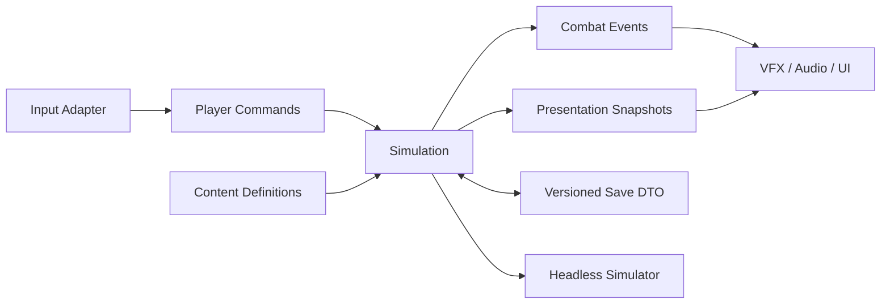

# Ashvault ARPG Kernel Specification

| | |
| --- | --- |
| **Status** | M0 contracts frozen |
| **Version** | 1.0 |
| **Runtime** | Godot 4.7.2 |
| **Targets** | Windows and macOS |

## 1. Purpose

This document defines the production boundary for Ashvault's first vertical
slice. The existing `project-ashvault/prototype/` scene remains a numerical
experiment and is not a production API.

The kernel must support long-lived ARPG content without duplicating rules in
skills, items, enemies, UI, saves, or scenes. Simulation is deterministic for a
fixed version, seed set, initial state, and command stream.

## M0 contract freeze

This specification contains both implemented foundations and normative design
for later milestones. Their status is explicit:

| Scope | Status |
| --- | --- |
| Sections 2–3 | Implemented and frozen in M0 |
| M0 performance report contract in section 12 | Implemented and frozen in M0 |
| Sections 4–9 | Implemented and gated in M1 |
| Production simulator behavior in section 12 | Implemented and gated in M1 |
| Sections 10–11 and representative-density targets in section 13 | Accepted for downstream implementation |

The frozen public surface is:

| Contract | Authoritative implementation | Compatibility key |
| --- | --- | --- |
| Production roots and dependency direction | `project-ashvault/game/README.md` | Kernel specification version |
| Stable IDs and registered tags | `project-ashvault/game/content/stable_id.gd`, `tag_registry.gd` | `content_version` |
| Transactional immutable catalog publication | `project-ashvault/game/content/content_definition.gd`, `content_catalog.gd` | `content_version` |
| Content, simulation, and save version fields | `project-ashvault/game/infrastructure/version_info.gd` | Individual version field |
| Performance aggregation and report shape | `project-ashvault/game/infrastructure/performance_metrics.gd`, `performance/performance-report.schema.json` | Report `schema_version` |
| Headless macOS and Windows validation entrypoint | `tools/ci/run_tests.py`, `.github/workflows/ci.yml` | CI workflow contract |
| Fixed-tick entity commands and presentation snapshots | `project-ashvault/game/simulation/entities/entity_world.gd`, `commands/player_command.gd`, `snapshots/presentation_snapshot.gd` | `simulation_version` |
| Deterministic headless combat replay | `project-ashvault/game/infrastructure/headless/headless_combat_simulation.gd`, `performance/simulation-report.schema.json` | `simulation_version` and report `schema_version` |
| M1 kernel correctness and regression gate | `performance/kernel-gate-v1.json`, `performance/kernel-gate.schema.json` | Gate `schema_version` |

Breaking changes to a frozen contract require its compatibility key to change,
together with updated tests and an explicit migration or compatibility policy.
Compatible additions may retain the current version. Downstream sections become
implemented only through their taskbook gates; specification text alone is not
an implementation claim.

## 2. Architectural boundary



- `Simulation` owns authoritative gameplay state.
- `Presentation` may interpolate and decorate state but cannot mutate it.
- Godot scenes compose lifecycle and visuals; they do not define combat rules.
- Godot Resources are immutable authored definitions.
- Runtime instances are plain simulation objects identified by stable IDs.
- Save DTOs contain data, not Nodes, Resources, callables, or scene paths.

## 3. Identity, tags, and versions

Stable content IDs use lowercase dotted names, for example
`ability.stormweaver.arc_bolt`. IDs are never derived from localized names or
filesystem locations.

An ID contains at least two dot-separated segments. Each segment starts with a
lowercase ASCII letter and may then contain lowercase ASCII letters, digits, or
underscores. Leading/trailing dots, empty segments, hyphens, whitespace, and
uppercase characters are invalid; values are rejected rather than normalized.

Tags use a validated registry and lowercase dotted names, such as
`damage.lightning`, `delivery.projectile`, and `event.kill`. Unknown IDs or tags
fail content validation before a run starts.

Tag registration is atomic for a batch: any invalid or duplicate tag rejects
the entire batch. The registry is frozen before a validated catalog is
published, and later registration attempts fail rather than mutate live rules.

The following versions are independent:

- `content_version`: authored definition compatibility.
- `simulation_version`: deterministic rules and replay compatibility.
- `save_schema_version`: serialized DTO layout and migration compatibility.

External research IDs never become canonical content IDs.

### Catalog publication

Catalog loading is transactional. Definitions are staged, then the complete
set is validated for ID syntax, duplicate IDs, registered tags, dependency
existence, duplicate dependencies, and dependency cycles. Any error rejects the
entire catalog without freezing inputs or publishing partial lookup state.

A successful load freezes every definition and the tag registry before making
the catalog available to a composition root. Definition array properties return
copies, and later scalar assignment or reconfiguration cannot mutate published
content. Gameplay may start only with a successfully loaded catalog.

## 4. Commands and simulation clock

Simulation advances through explicit 60 Hz ticks. Presentation frame rate does
not determine combat results, and an empty command batch still advances one
tick. Input adapters emit commands containing:

```text
tick
actor_id
command_type
aim_vector
ability_slot
client_sequence
```

The slice uses the stable command IDs `command.move`, `command.aim`,
`command.cast_start`, `command.cast_release`, and `command.cancel`. The
`aim_vector` field carries movement input for `command.move` and aim intent for
the other directional commands. `KeyboardMouseCommandAdapter` reads named
InputMap actions, converts mouse position to world aim, suppresses unchanged
intent, and emits these DTOs only. Physical key bindings are presentation data
and have no simulation dependency.

When a movement environment is configured, every living player-controlled
entity integrates its retained movement input once per accepted tick. Arena
bounds and static rectangular obstacles are expanded by actor radius and
resolved with continuous X-then-Y sweeps. This prevents tunneling and makes
wall sliding deterministic without a scene, rendered frame, or physics server.

One tick is a transaction. Commands are staged in actor-ID/client-sequence
order, and the complete staged batch publishes only when every transition is
valid. Unknown, late, future, impossible, non-player, non-monotonic, or duplicate
commands return one diagnostic and accept zero commands. Rejection does not
advance the tick, consume a client sequence, or retain earlier transitions from
the batch. Client sequences are positive and strictly increasing per actor.

Actors may opt into an immutable ability loadout that binds definitions and
cast policies to integer slots. Cast start validates slot, cooldown, and
resource but spends nothing. Release is valid only at or after the authored
ready tick; it atomically spends the resource cost and starts the slot cooldown.
The released phase is observable for that tick, followed by the exact authored
number of recovery ticks before idle. Invalid transitions reject the entire
world tick without consuming resources or client sequences.

Cast policies declare whether non-zero movement is allowed, locked, or cancels
the active cast; whether manual cancellation is allowed; which stable external
interruption reasons are accepted; and whether a binding may replace another
interruptible cast. Tempest Dash uses the same policy data as every other
ability and requires no ability-ID branch. Listed interruptions are applied in
actor/reason order before commands; unlisted reasons are deterministic no-ops.
Death always cancels a started or recovering cast.

The `client_sequence` field is reserved for future authority validation. It does
not imply networking in the slice.

The simulation publishes immutable `PresentationSnapshot` values sorted by
runtime entity ID. Each snapshot includes a SHA-256 hash of the authoritative
tick, fixed-rate identifier, entity state, and accepted client-sequence state.
Worlds without movement or loadouts preserve canonical hash schema version 1.
Movement-only worlds use schema version 2 and include normalized collision
configuration. Loadout-enabled worlds use schema version 3 and additionally
include cast policy, timing, cooldown, and resource state. Dictionary iteration
order is never hashed. Constructing snapshots is a pure read, so disabling
presentation cannot change authoritative state or replay hashes.

## 5. Deterministic RNG

Every run owns named RNG streams:

- `combat`: crits, proc rolls, and combat variance.
- `loot`: rarity, affix, and roll generation.
- `dungeon`: room graph and encounter selection.

Each stream exposes seed and serializable state. Adding a loot roll must not
change dungeon generation. Gameplay code may not use global random functions.

`RngStreams` owns all production randomness. It derives each stream seed from
the first 56 bits of SHA-256 over
`ashvault.rng.v1|<root_seed>|<stream_name>`, then owns one wrapped Godot
`RandomNumberGenerator` per stream. Production code outside that wrapper may
not instantiate `RandomNumberGenerator`; consumers acquire streams by their
registered names and unknown names return no stream.

Snapshot schema version 1 is JSON-safe and exact:

```text
schema_version
root_seed: canonical signed decimal string
streams:
  combat|loot|dungeon:
    name
    seed: canonical signed decimal string
    state: canonical signed decimal string
```

Restore requires exactly the registered streams and fields, validates derived
seeds, and rejects the complete snapshot before mutation on any error. It sets
each generator's seed before restoring its state and preserves already-acquired
stream handles. Decimal strings avoid precision loss in JSON implementations
that represent numbers with fewer than 64 integer bits.

Determinism is guaranteed only within the same `simulation_version` and
`content_version`. The derivation domain, names, snapshot shape, golden
sequences, and underlying Godot RNG behavior are simulation compatibility
contracts.

## 6. Stats and modifiers

A modifier contains:

```text
stat_id
operation
value
source_id
condition_id?
priority
target_stat_id? # CONVERSION only
```

Supported operations resolve in this order:

1. `BASE`
2. `FLAT`
3. `INCREASED`
4. `MORE`
5. `CONVERSION`
6. `OVERRIDE`
7. `CAP`

The registered default value is an implicit base. Explicit `BASE` and `FLAT`
values add in their respective stages. `INCREASED` values add within one bucket
and multiply once by `1 + bucket`; each `MORE` value multiplies by `1 + value`.

Modifiers resolve by descending numeric priority then ascending `source_id`.
A source may contribute at most one modifier for the same stat, operation, and
condition. Duplicate identities are validation errors rather than insertion
order tie-breaks.

Conversion values are fractions from 0 through 1 and require a distinct target
stat. A source stat allocates at most 100% in stable modifier order. All
converted amounts use the pre-conversion snapshot and apply simultaneously, so
incoming conversion cannot cascade during the same stage. The highest
precedence active `OVERRIDE` wins; remaining overrides are recorded as
shadowed. Every `CAP` is a maximum constraint and applies after the override.

Condition evaluation is external to stat resolution. The resolver receives the
active stable condition IDs and records inactive conditional modifiers rather
than silently discarding them.

Stat aggregation produces an immutable snapshot for one simulation tick.
Definitions contribute modifiers but never write final values directly. A
snapshot owns copies of final values and per-stat explanations containing
applied sources, skipped sources with reasons, conversion allocation, and
incoming conversion. Callers receive deep copies and cannot mutate the
published tick state.

Operation ordinals, ordering, conversion semantics, priority direction, and
snapshot fields are `simulation_version` compatibility contracts.

## 7. Damage pipeline

All attacks create a `DamageContext`; only the pipeline creates a
`DamageResult`.

```text
source_entity
target_entity
ability_id
origin_event_id
tags
base_components[]
modifiers[]
```

Resolution order is:

```text
base + flat
-> increased
-> more
-> conversion
-> critical
-> defense
-> resistance and penetration
-> conditional modifiers
-> final clamps and rounding
```

Damage is stored as floating point during resolution and rounded once when
committed to health. Negative final damage is forbidden; healing is a distinct
effect type. A result records component breakdown, mitigated amount, critical
state, and contributing source IDs for debugging and simulation reports.

Skills, items, status effects, enemies, and UI cannot implement alternative
damage math.

## 8. Combat events and proc safety

Events are queued rather than recursively executed. Every event contains:

```text
event_id
chain_id
depth
event_type
source_entity
target_entity?
source_definition
tags
payload
```

The default maximum proc depth is 8. A trigger cannot react to another event
created by the same trigger in the same chain unless its definition explicitly
sets `allow_self_reentry`. The queue has a per-tick budget; budget exhaustion
fails the simulation test and emits a diagnostic in development builds.

Core event types include cast, hit, critical, damage, status applied, death,
kill, block, dodge, item dropped, and item picked up.

## 9. Abilities and effects

An `AbilityDefinition` declares tags, cost, cooldown, cast timing, targeting,
delivery, and an ordered effect list. Effects may deal damage, apply a status,
move an entity, spawn a projectile or persistent entity, or emit an event.

Ability ranks select data values or milestone behaviors. They do not branch on
item names. Items and passives modify abilities through tags, modifiers, or
validated effect transforms.

The Stormweaver slice binds:

| Input | Ability | Required kernel coverage |
| --- | --- | --- |
| LMB | Arc Bolt | Aimed projectile and critical hit |
| RMB | Chain Lightning | Target chain and shock |
| Q | Thunder Nova | Player-centered area |
| E | Static Ward | Timed defensive status |
| R | Storm Totem | Persistent casting entity |
| Space | Tempest Dash | Movement, invulnerability window, cancel rules |

### 9.1 Spatial delivery runtime

`DeliveryWorld` is the authoritative fixed-tick owner for projectile movement,
instant areas, target chains, persistent pulses, and their hit records. It
accepts immutable target snapshots rather than scene nodes. Requests are sorted
by globally increasing request ID; active runtime objects are sorted by their
monotonic runtime ID.

| Delivery | Deterministic rule |
| --- | --- |
| Projectile | Swept segment-circle collision, then earliest contact time and target ID. |
| Area | Inclusive radius query, then distance and target ID. |
| Chain | Recover a missing primary target, then exclude prior targets per jump. |
| Persistent | Pulse on spawn and fixed intervals before the exclusive expiry tick. |

Projectile and persistent delivery use compact scalar `RefCounted` state. Area
and chain requests resolve immediately without allocating a runtime object. The
world stores one accepted-request watermark instead of an unbounded ID history.
A rejected target/request batch commits no tick, allocator, active-state, or
watermark changes.

State Charts may mirror delivery state for animation and feedback, but collision
and lifetime authority remain in simulation. M2-06 composes a delivery request
from `AbilityEffectCommand` plus delivery-specific geometry. Projectile speed
and lifetime are derived from the effect command rather than authored twice.

### 9.2 Status runtime and Shock

`StatusWorld` is configured from immutable definitions and owns active status
state at the fixed-tick boundary. A definition declares stable identity and
tags, accepted application-duration bounds, maximum stacks, stacking policy,
refresh policy, removal policy, and optional conditional damage modifiers.

| Policy | Supported data-defined behavior |
| --- | --- |
| Stacking | Add, replace, or retain the maximum stack count, capped by the definition. |
| Refresh | Keep current expiry, reset from the application tick, or extend current expiry. |
| Removal | Cleanse when permitted, or force removal for authoritative lifecycle cleanup. |
| Immunity | Match an exact status ID or any status tag from the target snapshot. |

Expiry is exclusive: a status with expiry tick `N` is removed before mutations
at tick `N`. Expiration and mutations publish immutable change records. Invalid
batches commit no tick, active state, or mutation watermark. A forced removal
may clean up state after target loss; gameplay cleanses require a live target.

Active status IDs enter `DamageContext.active_conditions`. Shock materializes a
normal conditional `DamageModifier` scaled by its stack count and is resolved in
the existing conditional damage stage. The concrete Shock duration, stack cap,
and percentage remain authored Stormweaver content owned by M2-06.

Successful applications emit configured `event.status_applied` requests. They
must be enqueued through `CombatEventQueue`; status code cannot call reaction
handlers directly or bypass self-reentry, depth, and per-tick budget guards.

### 9.3 Ordinary enemy runtime

`EntityWorld` is the authoritative owner of ordinary enemy position, health,
target selection, attack cadence, and death transition. Each enemy combines an
immutable definition with compact runtime state: actor ID, current target ID,
and next attack tick. Ordinary enemies do not require a scene Node,
`NavigationAgent2D`, behavior tree, or state chart.

Damage results commit before enemy decisions in stable target/event/source
order. Exactly one `event.kill` request is emitted when health crosses from
alive to dead; overkill and later corpse hits cannot create another kill.
Living enemies retain a valid target or acquire the nearest living player by
distance and runtime ID. Movement uses actor-specific speed and radius through
the shared bounded environment, stops at inclusive attack range, and quantizes
position at the authoritative commit boundary for cross-platform replay
stability. An enemy in range publishes an immutable attack intent on its exact
cooldown tick; StormweaverCombat composes that intent through the ordinary ability and
damage pipeline.

Enemy state-hash schema v4 converts every canonical float to a millionth-unit
fixed-point integer before JSON serialization. Older world schemas remain
unchanged; platform-specific float-to-decimal formatting cannot alter v4
replay hashes.

Godot navigation maps may be introduced with authored room topology, and
LimboAI may drive low-count boss or elite intent. Neither may become a second
owner of ordinary-enemy simulation state.

### 9.4 Stormweaver composition

`StormweaverCatalog` authors six activation definitions, four entity-targeted
impact definitions, delivery geometry, and defensive/Shock statuses. Geometry
is selected before `AbilityExecutor` executes the impact graph. Projectile
speed/lifetime and totem duration come from the activation effect; damage is
never applied merely because a projectile was spawned.

| Slot | Ability | Initial content |
| --- | --- | --- |
| 0 | Arc Bolt | 600 units/s, 60-tick lifetime, one target; 20 + 0.5 power lightning damage. |
| 1 | Chain Lightning | 300-unit acquisition, 100-unit jumps, four targets; 24 + 0.5 power damage and Shock. |
| 2 | Thunder Nova | 100-unit player-centered radius; 32 + 0.5 power damage. |
| 3 | Static Ward | 30% incoming damage reduction for 240 ticks. |
| 4 | Storm Totem | Aimed placement up to 100 swept units away; one nearest target within 150 units every 30 ticks, for 180 ticks; 12 + 0.5 power damage. |
| 5 | Tempest Dash | 120 swept units over 12 ticks with damage immunity; replaces an interruptible cast. |

Shock grants 10% additional incoming damage per stack, capped at three stacks,
and refreshes its 180-tick duration. Ward and dash immunity cover the damage
types present in configured impact graphs, including conversion destinations.
They use the existing multiplicative conditional stage, so immunity remains
zero damage even alongside Shock or Ward.

Rank 5 uses shared effect transforms: damage bases increase by 50%, Ward lasts
360 ticks, and Dash travels 180 units. Ranks 1–20 are accepted; no additional
rank milestones are currently authored. Item transforms replace one damage
effect per damaging skill after rank resolution. They preserve cast costs,
delivery, and graph validation; item ownership and stat aggregation remain M3.
The current slice uses power 10, critical chance 10%, and multiplier 1.5.

`StormweaverCombat` accepts one player, immutable content, a movement environment,
a seed, and optional enemy profiles with explicit attack definitions. Its tick
order is:

1. Validate commands and interruptions against a staged EntityWorld.
2. Apply authored dash displacement instead of ordinary movement; interruption
   stops movement and removes its protection in the same tick.
3. Resolve activation, delivery hits, and defensive status expiry/application.
4. Execute player impacts against those statuses. Newly applied Shock affects
   subsequent ticks; it does not retroactively amplify other same-tick hits.
5. Commit player damage in a preview before obtaining enemy attack intents,
   preventing an enemy killed this tick from attacking.
6. Resolve surviving enemy attacks, then publish entity/status/delivery/RNG
   state and process events through the bounded CombatEventQueue.

An invalid command or execution error publishes nothing, including resource
cost, cooldown, sequence watermarks, RNG draws, and the previous report.
Projectile and totem requests retain their original source and persist until
their authored lifetime ends, even if the source dies. Empty chain casts consume
cost/cooldown and have no impact. Acquisition chooses nearest distance, then
runtime ID; the current command contract has no explicit cursor target ID.

`report()` returns copied structured hit, damage, status, event, and hash
records; `presentation_snapshot()` is an optional read-only entity view.
Combined and 120-enemy replay hashes are checked by the same macOS/Windows
fixture. Reproduce all six captures with:

```sh
"$ASHVAULT_GODOT" --headless --path project-ashvault \
  --script res://tests/production/test_stormweaver_abilities.gd
```

The default combat arena integrates the HUD, six ability inputs, bounded visual
and audio feedback, and camera intensity. See the
[presentation guide](../project-ashvault/game/presentation/README.md) for seeded
12/120-enemy captures and presentation-disabled determinism checks. Elite
telegraphs are presentation fixtures until M4 supplies authoritative attacks.

## 10. Items and rarity semantics

`ItemDefinition` is immutable authored content. `ItemInstance` contains:

```text
uid
definition_id
item_level
rarity
affixes[]
rolls[]
sockets[]
quality
metadata
```

UID creation belongs to the simulation boundary. Copies retain definition IDs
but never reuse UIDs. The implemented
[item contracts](../project-ashvault/game/simulation/items/README.md) define
namespace/counter allocation, immutable instance records, and validated JSON
snapshots. The implemented
[affix rules](../project-ashvault/game/simulation/items/AFFIX_GENERATION.md) add
frozen tier Resources, rarity budgets, base/slot/group/exclusion validation, and
transactional loot-RNG generation.
[EquipmentState](../project-ashvault/game/simulation/items/EQUIPMENT.md) applies
eight-slot transactions and resolves base, affix, and numeric set contributions
through StatResolver before publishing.
[LootState](../project-ashvault/game/simulation/items/LOOT.md) adds source-bound
weighted tables, deterministic occurrence receipts, and atomic reserved-owner
pickup into bounded bags.
[InventoryState](../project-ashvault/game/simulation/items/INVENTORY.md) owns
shared ground/bag/stash/vendor/equipment locations and atomic price/currency
transactions. GLoot receives detached presentation values; SaveGameV1 builds
on these simulation-owned snapshots in a later M3 task.
[Crafting](../project-ashvault/game/simulation/items/CRAFTING.md) adds deterministic
material recipes, immutable same-UID replacement, salvage retirement, and
white-base ordered runewords. Quality and rune effects use the shared equipment
stat resolver.

The slice uses these generation rules:

| Rarity | Role |
| --- | --- |
| White | Base, quality, sockets, runeword eligibility, crafting potential |
| Blue | At most two affixes, higher individual tier ceiling, cheapest targeted reroll |
| Gold | At most four affixes and broad emergent combinations |
| Green | Target-farmable fixed implicit plus two or three random affixes |
| Purple | Narrow reliable interaction plus bounded random rolls |
| Red | Rule-changing unique with no universal stat budget advantage |
| Set | Individual competitive pieces with useful 2/3/4-piece thresholds |

The authored slice contains 24 ordinary bases, 6 green items, 8 purple items, 8
red items, and 4 set pieces. Generated white, blue, and gold items reuse the 24
bases. It also contains 36 affixes, 6 runes, and 3 runewords.

### Character progression

[CharacterProgression](../project-ashvault/game/simulation/progression/README.md)
keeps lifetime XP, skill/passive allocations, and per-run XP sequence watermarks.
Levels and available points derive from a frozen authored XP curve. Allocation
requires earned points, level/prerequisite eligibility, and the current revision;
only explicit respec removes allocations. Passive modifiers use StatResolver and
skill ranks select existing AbilityDefinition milestones. Strict JSON restore
rebuilds this state between runs; durable file persistence belongs to SaveGameV1.

## 11. Save contract

`SaveGameV1` contains character, inventory, progression, world-run, settings,
RNG, and version DTOs. Saves use atomic temporary write plus rename and retain
one last-known-good backup.

Loading follows:

```text
read -> structural validation -> checksum validation -> migration chain
-> content reference validation -> simulation reconstruction
```

A failed primary save attempts the backup and reports recovery. Missing content
references are errors during development; release policy must be explicit before
content removal. Migrations are forward-only and individually tested.

The implemented [SaveGameV1 contract](../project-ashvault/game/infrastructure/save/README.md)
uses an exact-payload SHA-256 envelope, fresh simulation reconstruction, and
verified temporary/backup replacement. It currently persists a single-character
checkpoint, including inventory ownership and loot receipts; transient combat
resumption and future dungeon state are outside this first schema.

## 12. Headless simulator and observability

The simulator accepts a build definition, encounter definition, seeds,
simulation version, and duration. Output is machine-readable and includes DPS,
damage mix, critical rate, proc rate, kills per second, damage taken, event
depth, entity counts, and tick-time percentiles.

Every damage result and generated item must be explainable by source IDs. Debug
traces are opt-in so production-density tests do not pay their allocation cost.

Performance reports use versioned machine-readable contracts with runtime and
workload metadata, sample count, entity-count statistics, and nearest-rank P50,
P95, and P99 tick times. Harnesses advance simulation directly under a headless
`SceneTree`; loading or awaiting rendered frames is forbidden. The M0 synthetic
fixed-tick report remains frozen at schema version 1. The M1 production combat
simulator publishes its deterministic replay and combat fields through the
separate `simulation-report.schema.json` contract, while reusing the same
`PerformanceMetrics` aggregation for observed tick measurements.

M3 adds a separate [Build V1 comparison contract](../project-ashvault/game/infrastructure/headless/README.md).
It resolves exact UIDs or base/affix/rarity constraints against published items,
executes the actual Stormweaver skill paths with equipment-derived player stats,
and compares single-slot candidates in a fixed seeded arena. Reports retain
metrics, item provenance, rarity composition, and state hashes. The four-profile
regression gate requires blue/gold/green/purple best-slot evidence and rejects
red/set dominance, including ties. This bounded candidate-pool gate does not
replace M5's final content authoring, progression budgets, or full-encounter tuning.

M1 closes only when `kernel-gate-v1.json` accepts the current report and its
archived Apple M1 Pro reference capture. The two-entity fixture has an 8 ms
portable P95 smoke bound and a 1 ms M1 Pro P95 reference bound. These detect
kernel regressions but do not satisfy the representative-density target below.

## 13. Performance and compatibility targets

The slice target is 1080p at 60 FPS with 120 live enemies and 500 projectiles.
Simulation P95 must remain at or below 8 ms on an Apple M1 Pro and on the
Windows reference profile (Ryzen 5 3600, GTX 1660, 16 GB RAM). A 30-minute soak
must not show unbounded entity, event, or allocation growth.

Production code may use Nodes for low-count composition and presentation. High
count enemies, projectiles, and transient effects use compact simulation-owned
state and batched queries.

Deterministic replays and saves are not promised across a
`simulation_version` change without an explicit compatibility adapter.
