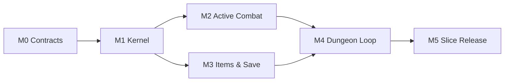

# Ashvault Development Taskbook

| | |
| --- | --- |
| **Status** | Active |
| **Product target** | Production vertical slice |
| **Runtime** | Godot 4.7.2 |
| **Platforms** | Windows and macOS |
| **Source of truth** | This document and linked specifications |

## 1. Target outcome

The first production slice is a persistent single-player ARPG loop:

```text
Town -> prepare build -> seeded modular dungeon -> boss
     -> rewards -> return -> equip/craft -> repeat
```

One run lasts 20–30 minutes. The playable class is Stormweaver with six active
abilities and twelve passive nodes. The slice includes eight ordinary enemies,
two elites, one multi-stage boss, representative combat VFX/audio, and enough
item diversity to prove that high rarity is not a universal replacement ladder.

The numerical sketch remains under `project-ashvault/prototype/` as an
experiment. Production code may reuse validated formula shapes, but not its
combined simulation/presentation structure.

## 2. Operating rules

- Milestone exit gates, not dates, authorize downstream work.
- `S`, `M`, and `L` express relative complexity, not time estimates.
- Every task has exactly one GitHub Milestone, type, priority, and size.
- A task may start only when all `Blocked by` tasks are closed.
- Stable behavior is developed test-first where practical.
- Product rules live in the kernel or content definitions, never in UI/VFX.
- Any public contract change updates
  [`ARPG_KERNEL_SPEC.md`](ARPG_KERNEL_SPEC.md) in the same change.
- Third-party research data is design evidence only and never ships at runtime.
- `P0` blocks the slice. `P1` is required for the milestone gate. `P2` may be
  deferred only through an explicit taskbook amendment.

### Issue body contract

Every executable Issue uses these sections:

```markdown
## Outcome
## In scope
## Out of scope
## Blocked by
## Acceptance criteria
## Validation
```

### GitHub execution mirror

| Milestone | Task keys | GitHub Issues |
| --- | --- | --- |
| [M0 Contracts](https://github.com/SunChJ/ashvault/milestone/1) | M0-01…M0-06 | [#1](https://github.com/SunChJ/ashvault/issues/1)…[#6](https://github.com/SunChJ/ashvault/issues/6) |
| [M1 Production Kernel](https://github.com/SunChJ/ashvault/milestone/2) | M1-01…M1-08 | [#7](https://github.com/SunChJ/ashvault/issues/7)…[#14](https://github.com/SunChJ/ashvault/issues/14) |
| [M2 Active Combat](https://github.com/SunChJ/ashvault/milestone/3) | M2-01…M2-08 | [#15](https://github.com/SunChJ/ashvault/issues/15)…[#22](https://github.com/SunChJ/ashvault/issues/22) |
| [M3 Items and Save](https://github.com/SunChJ/ashvault/milestone/4) | M3-01…M3-09 | [#23](https://github.com/SunChJ/ashvault/issues/23)…[#31](https://github.com/SunChJ/ashvault/issues/31) |
| [M4 Dungeon Loop](https://github.com/SunChJ/ashvault/milestone/5) | M4-01…M4-08 | [#32](https://github.com/SunChJ/ashvault/issues/32)…[#39](https://github.com/SunChJ/ashvault/issues/39) |
| [M5 Slice Release](https://github.com/SunChJ/ashvault/milestone/6) | M5-01…M5-09 | [#40](https://github.com/SunChJ/ashvault/issues/40)…[#48](https://github.com/SunChJ/ashvault/issues/48) |

Task keys remain stable if GitHub Issue numbers ever change. The Issue title is
the authoritative key-to-number mapping.

## 3. Critical path



M2 and M3 may proceed in parallel after M1. Content authoring begins only after
the relevant schema and validator task is closed.

## 4. M0 — Contracts

**Goal:** create the production boundary before adding production gameplay.

| Key | Task | Size | Priority | Blocked by |
| --- | --- | --- | --- | --- |
| M0-01 | Establish production directories and isolate the prototype | S | P0 | — |
| M0-02 | Implement stable content IDs, tag registry, and version constants | M | P0 | M0-01 |
| M0-03 | Establish headless tests and Windows/macOS CI | M | P0 | M0-01 |
| M0-04 | Build content catalog loading and validation | M | P0 | M0-02 |
| M0-05 | Establish simulation performance baseline tooling | M | P1 | M0-03 |
| M0-06 | Review and freeze M0 production contracts | S | P0 | M0-02, M0-03, M0-04, M0-05 |

### M0 acceptance gate

- Production modules have explicit simulation, content, presentation, and
  infrastructure ownership.
- Unknown content IDs/tags and invalid dependency references fail validation.
- Headless tests run on macOS locally and Windows/macOS in CI.
- The prototype has no import path into production code.
- The Kernel specification matches implemented public contracts.

## 5. M1 — Production kernel

**Goal:** implement deterministic, scene-independent ARPG rules.

| Key | Task | Size | Priority | Blocked by |
| --- | --- | --- | --- | --- |
| M1-01 | Implement named deterministic RNG streams | M | P0 | M0-06 |
| M1-02 | Implement stat registry, modifier operations, and snapshots | L | P0 | M0-06 |
| M1-03 | Implement the unified damage pipeline and result breakdown | L | P0 | M1-02 |
| M1-04 | Implement queued combat events and proc-chain guards | L | P0 | M1-01, M1-03 |
| M1-05 | Implement ability definitions and effect execution | L | P0 | M1-02, M1-04 |
| M1-06 | Implement entity state, player commands, and presentation snapshots | L | P0 | M1-01, M1-02 |
| M1-07 | Implement headless combat simulation and deterministic replay | L | P1 | M1-03, M1-04, M1-05, M1-06 |
| M1-08 | Pass kernel correctness and performance gate | M | P0 | M1-07 |

### M1 acceptance gate

- Identical version, seeds, initial state, and commands produce an identical
  state hash and report.
- Modifier ordering, conversion conflicts, caps, criticals, defenses,
  resistance, and penetration have boundary tests.
- Proc chains cannot recurse or exceed depth/budget silently.
- Skills, items, and enemies cannot bypass the damage pipeline.
- Kernel tests run without loading a gameplay scene.

## 6. M2 — Stormweaver active combat

**Goal:** prove that the kernel supports responsive active ARPG combat.

| Key | Task | Size | Priority | Blocked by |
| --- | --- | --- | --- | --- |
| M2-01 | Implement keyboard/mouse command adapter and player movement | M | P0 | M1-06 |
| M2-02 | Implement cast timing, cooldowns, resource costs, and cancellation | L | P0 | M1-05, M2-01 |
| M2-03 | Implement targeting, projectiles, areas, chains, and persistent entities | L | P0 | M1-05, M1-06 |
| M2-04 | Implement status effects and the Shock rules | M | P0 | M1-04, M1-05 |
| M2-05 | Implement ordinary enemy navigation, attacks, hit, and death | L | P0 | M1-06, M2-03 |
| M2-06 | Author the six Stormweaver active abilities | L | P0 | M2-02, M2-03, M2-04 |
| M2-07 | Implement combat HUD, bindings, resources, and cooldown feedback | M | P1 | M2-02, M2-06 |
| M2-08 | Deliver representative combat VFX, audio, camera, and readability gate | L | P1 | M2-05, M2-06, M2-07 |

### Ability bindings

| Input | Ability | Primary coverage |
| --- | --- | --- |
| LMB | Arc Bolt | Aim, projectile, critical hit |
| RMB | Chain Lightning | Target chaining and Shock |
| Q | Thunder Nova | Player-centered area |
| E | Static Ward | Timed defensive status |
| R | Storm Totem | Persistent casting entity |
| Space | Tempest Dash | Movement, cancellation, invulnerability window |

### M2 acceptance gate

- All six abilities resolve through shared definitions, effects, and damage.
- Movement, aim, casts, cancellation, and feedback remain readable with 120
  live enemies.
- Presentation can be disabled without changing simulation results.
- Combat capture demonstrates distinct projectile, chain, area, defensive,
  persistent-entity, and movement behaviors.

## 7. M3 — Items, loot, progression, and save

**Goal:** prove persistent Build construction without a monotonic rarity ladder.

| Key | Task | Size | Priority | Blocked by |
| --- | --- | --- | --- | --- |
| M3-01 | Implement immutable item definitions and UID item instances | L | P0 | M0-04, M1-01, M1-02 |
| M3-02 | Implement rarity, affix generation, tiers, and roll constraints | L | P0 | M3-01 |
| M3-03 | Implement equipment slots and stat aggregation | L | P0 | M1-02, M3-02 |
| M3-04 | Implement loot tables, deterministic drops, and pickup ownership | L | P0 | M1-01, M3-02 |
| M3-05 | Implement inventory, stash, and vendor transactions | L | P1 | M3-01, M3-03 |
| M3-06 | Implement salvage, quality, reroll, sockets, runes, and runewords | L | P1 | M3-02, M3-05 |
| M3-07 | Implement persistent character levels, skill points, and passives | M | P0 | M1-02, M1-05 |
| M3-08 | Implement SaveGameV1, atomic backup, validation, and migrations | L | P0 | M1-01, M3-01, M3-07 |
| M3-09 | Add build schema, loadout simulation, and rarity-value gate | L | P0 | M1-07, M3-03, M3-06, M3-08 |

### Slice item budget

| Content | Count |
| --- | ---: |
| Ordinary bases used by white/blue/gold | 24 |
| Monster-specific green items | 6 |
| Purple epic items | 8 |
| Red rule-changing uniques | 8 |
| Set pieces | 4 |
| Affixes | 36 |
| Runes / runewords | 6 / 3 |

### M3 acceptance gate

- Item instances never share UIDs and never serialize Resources or Nodes.
- Generated affixes are legal for base, slot, item level, rarity, and group.
- Save round-trip and every migration preserve ownership and RNG state.
- Corrupt primary saves recover from the last-known-good backup.
- Across the four reference Builds, blue, gold, green, and purple each form at
  least one best-slot candidate; no Build defaults to all red/set equipment.
- White bases retain value through quality, sockets, runewords, and crafting.

## 8. M4 — Town and modular dungeon loop

**Goal:** assemble combat and progression into the complete repeatable loop.

| Key | Task | Size | Priority | Blocked by |
| --- | --- | --- | --- | --- |
| M4-01 | Define authored room modules and connection contracts | M | P0 | M0-04, M1-01 |
| M4-02 | Implement seeded dungeon graph assembly and validation | L | P0 | M4-01 |
| M4-03 | Implement encounter director and pacing budgets | L | P0 | M2-05, M4-02 |
| M4-04 | Implement town services and dungeon entry flow | L | P1 | M3-05, M3-06, M3-08 |
| M4-05 | Author eight ordinary enemy archetypes | L | P0 | M2-05, M4-03 |
| M4-06 | Author two independent elite archetypes and reward rules | M | P0 | M3-04, M4-03, M4-05 |
| M4-07 | Author the multi-stage dungeon boss | L | P0 | M2-08, M4-03, M4-05 |
| M4-08 | Complete death, boss reward, return, rebuild, and re-entry flow | L | P0 | M4-04, M4-06, M4-07 |

### M4 acceptance gate

- A seeded dungeon always has one reachable entrance, exit, and boss room.
- The same dungeon seed and content version reproduce layout and encounters.
- The complete loop lasts 20–30 minutes for an expected-power Build.
- Death, interruption, return, and re-entry cannot duplicate rewards or corrupt
  the save.
- Boss completion results in a meaningful equipment or crafting decision.

## 9. M5 — Balance, quality, and slice release

**Goal:** turn the assembled loop into a verified internal release candidate.

| Key | Task | Size | Priority | Blocked by |
| --- | --- | --- | --- | --- |
| M5-01 | Author and validate all 50 item/base definitions | L | P0 | M3-09, M4-06, M4-07 |
| M5-02 | Author 36 affixes, 6 runes, and 3 runewords | L | P0 | M3-06, M3-09 |
| M5-03 | Author 12 passives and four reference Builds | L | P0 | M2-06, M3-07, M3-09 |
| M5-04 | Tune progression, loot, crafting, combat, and rarity diversity | L | P0 | M4-08, M5-01, M5-02, M5-03 |
| M5-05 | Polish UI, settings, remapping, and basic accessibility | L | P1 | M2-07, M4-08 |
| M5-06 | Meet density, frame-time, and 30-minute soak targets | L | P0 | M1-08, M4-08, M5-04 |
| M5-07 | Complete save, migration, recovery, and data-integrity soak | M | P0 | M3-08, M4-08, M5-04 |
| M5-08 | Produce and smoke-test Windows and macOS exports | M | P0 | M5-05, M5-06, M5-07 |
| M5-09 | Run three external playtest rounds and close the release gate | L | P0 | M5-08 |

### Reference Builds

1. Critical projectile Arc Bolt.
2. Chain Lightning with Shock scaling.
3. Close-range Thunder Nova and Static Ward.
4. Storm Totem with event-driven procs.

### M5 acceptance gate

- All P0 and P1 slice Issues are closed or explicitly superseded.
- All four reference Builds complete the dungeon and expose different item
  priorities.
- At 1080p with 120 enemies and 500 projectiles, simulation P95 is at most 8 ms
  on Apple M1 Pro and the Windows reference profile.
- A 30-minute soak shows no unbounded entity, event, or allocation growth.
- Clean Windows and macOS machines can create a save and complete the loop.
- Three external playtest rounds contain no unresolved progression blocker,
  save-loss issue, or unreadable mandatory combat mechanic.

## 10. Long-term roadmap

These are outcome-level epics. Do not create child Issues until M5 supplies
measured throughput and the preceding epic's contracts are accepted.

1. Produce Act I and the quest/state framework.
2. Complete the compressed four-act campaign.
3. Add repeatable dungeons, target farming, and Codex modifiers.
4. Add classes, the candidate-based Build planner, and loot filters.
5. Add versioned seasonal mechanics and content packages.
6. Add friends-only host-authoritative co-op.
7. Start server-authoritative economy work only after approving trading,
   marketplace, or competitive ladder requirements.

## 11. Global validation matrix

| Concern | Required evidence |
| --- | --- |
| Determinism | Replay state hash for identical versions, seeds, state, and commands |
| Combat | Unit and integration coverage for every pipeline stage and event guard |
| Content | Catalog validation with no unknown IDs, tags, cycles, or illegal affixes |
| Items | Generation-property tests and four-Build rarity report |
| Save | Round-trip, migration, corruption, backup recovery, interrupted-write tests |
| Dungeon | Batch seed reachability, uniqueness, pacing, and reproduction tests |
| Performance | P50/P95/P99 tick metrics plus 30-minute soak |
| Presentation | Captures for each skill, elite, boss phase, and high-density scene |
| Platform | Clean-machine Windows/macOS export smoke tests |

## 12. Explicit exclusions for the slice

- Multiplayer, accounts, trading, marketplace, ladder, and server services.
- Gamepad, consoles, mobile, localization production, and final accessibility
  certification.
- Additional playable classes, four-act campaign content, endgame, or seasons.
- Final character/environment art and public-demo marketing polish.
- Runtime dependency on Hero Siege data or compatibility with its identifiers.
