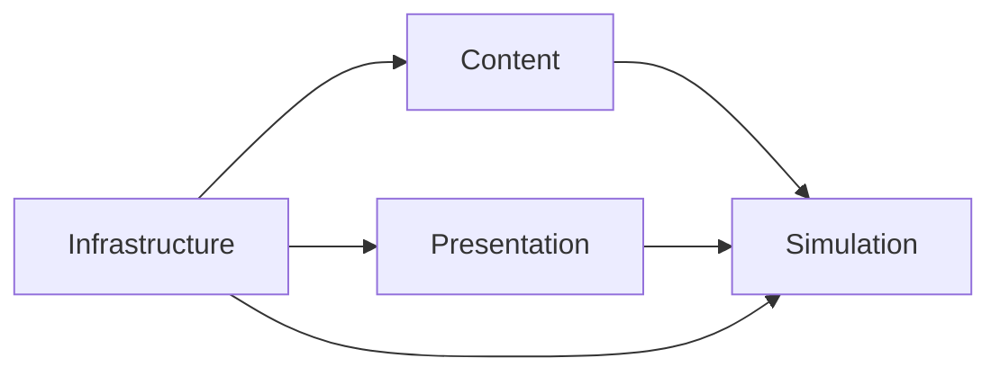

# Production Game Boundary

`game/` contains Ashvault's production implementation. The numerical sketch in
`prototype/` is a disposable experiment and is not a production dependency.

## Roots

| Root | Ownership |
| --- | --- |
| `simulation/` | Deterministic game state, rules, commands, events, and snapshots. |
| `content/` | Immutable authored definitions and their validation contracts. |
| `presentation/` | Scenes, rendering, UI, VFX, audio, and input adaptation. |
| `infrastructure/` | Composition, catalogs, persistence adapters, exports, and tooling integration. |

## Dependency rules

- Production files must never load or preload anything under `res://prototype/`.
- Simulation must not depend on scenes, presentation, input devices, or rendered
  frame timing.
- Presentation consumes commands, events, and snapshots; it does not own game
  state or rules.
- Content definitions are immutable after catalog validation.
- Infrastructure composes the other roots without moving their responsibilities.

Repository-level architecture tests enforce the prototype boundary. More
specific root-to-root constraints are introduced with the contracts that need
them rather than inferred from directory names alone.
